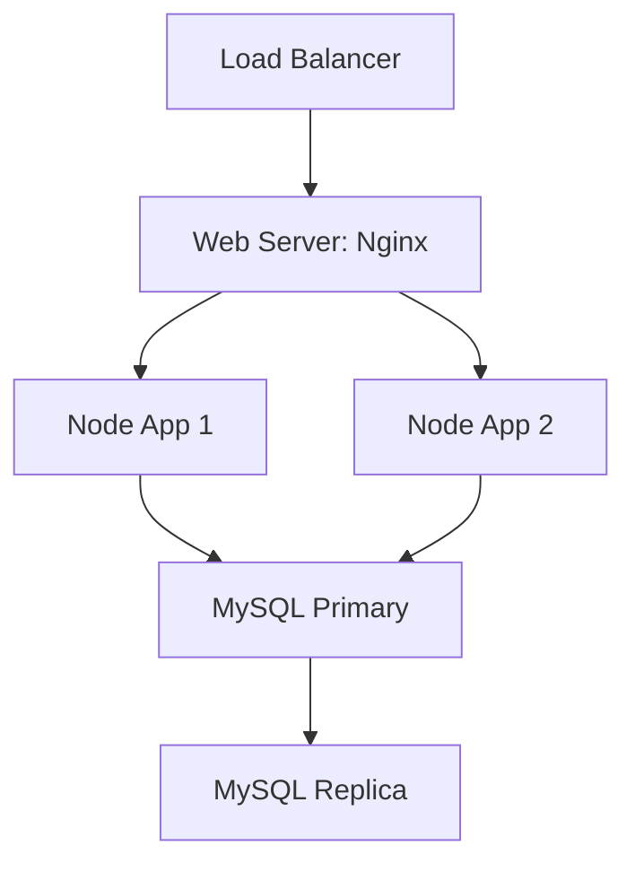

# System Architecture

This document describes the high-level architecture of the Equipment Rental Management system.

```mermaid
flowchart LR
  subgraph Client
    A[Frontend (React/Vue/Angular)]
  end

  subgraph API[Backend - Node.js / Express]
    B[Express App]
    B --> C[Auth Controller]
    B --> D[Equipment Controller]
    B --> E[Rental Controller]
    B --> F[Report Controller]
    B --> G[Swagger UI]
  end

  subgraph DB[MySQL Database]
    H[(users)]
    I[(equipment)]
    J[(rentals)]
    K[(logs)]
  end

  A -- HTTP / HTTPS --> B
  B -- SQL via mysql2 --> DB
  C -- reads/writes --> H
  D -- reads/writes --> I
  E -- reads/writes --> J
  F -- analytics --> H & I & J & K
```

**Components**

- Frontend: Single Page Application (recommended React) that calls backend APIs and handles authentication, UI state and user flows.
- Backend: Node.js + Express exposing RESTful endpoints. Uses `mysql2/promise` for database access. Supports CORS and JWT-based auth.
- Database: MySQL database containing `users`, `equipment`, `rentals`, `logs` and views for reporting.
- Swagger UI: In-app API documentation available at `/api-docs`.

**Data flow**

- Users interact with the frontend which sends HTTP(S) requests to the backend.
- The backend authenticates requests (JWT), performs business logic and persists or queries data from MySQL.
- Reports and analytics use SQL views and stored procedures in `src/config/schema.sql`.

**Deployment notes**

- Use environment variables for secrets and DB configuration.
- For production, run behind a reverse proxy (Nginx) with TLS termination.
- Use connection pooling (already present via `mysql2` pool) and horizontal scaling of stateless backend instances.

**Security considerations**

- Use strong `JWT_SECRET` and shortish token expiry plus refresh tokens if needed.
- Store hashed passwords (bcrypt) - the schema uses hashed placeholders.
- Restrict CORS to trusted frontend origins.
- Run DB with least privileges for the app user.


