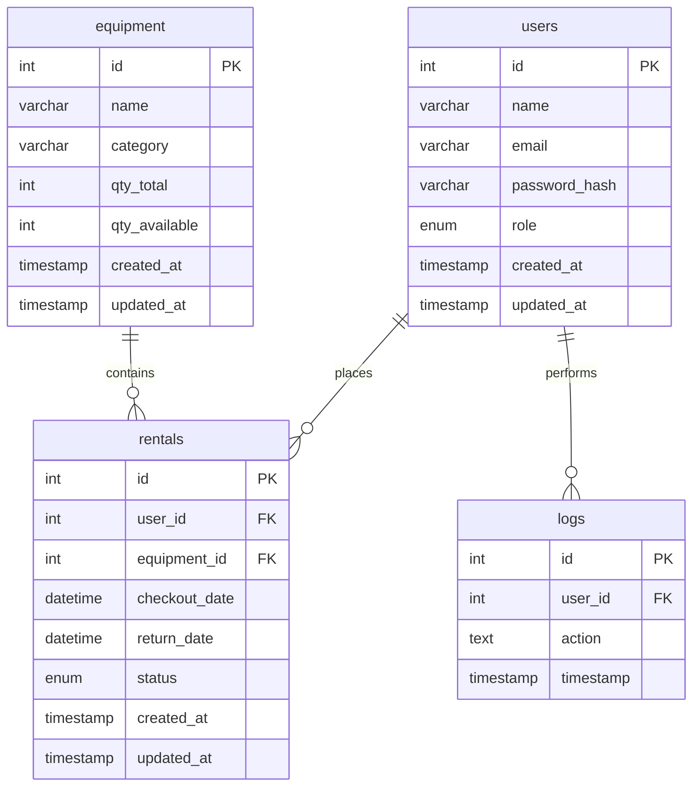

# Entity Relationship Diagram (ERD)

This section provides an ERD description and a Mermaid diagram representing the data model used by the application.

**Relationships**

- `users` (1) — (0..\*) `rentals`: a user can have many rentals; each rental belongs to one user. Foreign key: `rentals.user_id` -> `users.id`.
- `equipment` (1) — (0..\*) `rentals`: equipment can be checked out in many rentals over time; each rental references one equipment item. Foreign key: `rentals.equipment_id` -> `equipment.id`.
- `users` (1) — (0..\*) `logs`: actions performed by users are recorded in `logs` with optional `user_id`.

**Constraints & notes**

- `equipment.qty_available` must be >= 0 and <= `qty_total` (enforced by DB check constraint where supported).
- `rentals.return_date` must be later than `checkout_date`.
- Passwords are stored as bcrypt hashes in `users.password_hash`.
- Indexes exist on `email`, `category`, `qty_available`, and several foreign keys to improve query performance.

**Views and stored procedures**
`src/config/schema.sql` creates useful views: `active_rentals`, `overdue_rentals`, `equipment_utilization`, and `user_activity_summary`. It also includes stored procedures for checkout/return operations that maintain transactional integrity.
